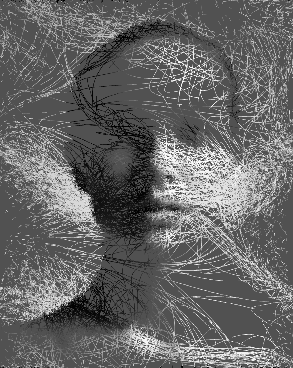

## Input image

## Example of processed image

## Issues
It seems that resizing one of the dimensions of the input image to a power of 2 avoids some problems with ofSaveScreen ([see the forum](https://forum.openframeworks.cc/t/ofsavescreen-saves-black-images-macos/23827/2) for more infos).